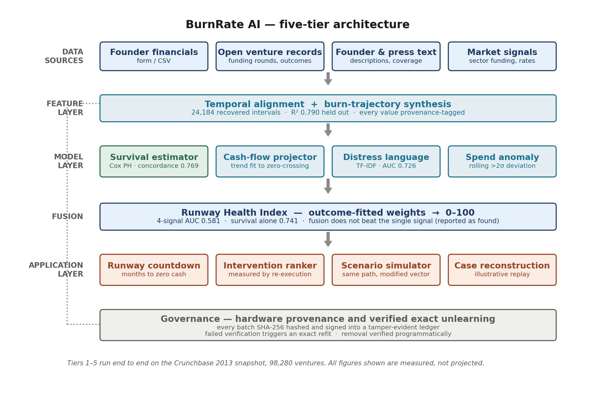
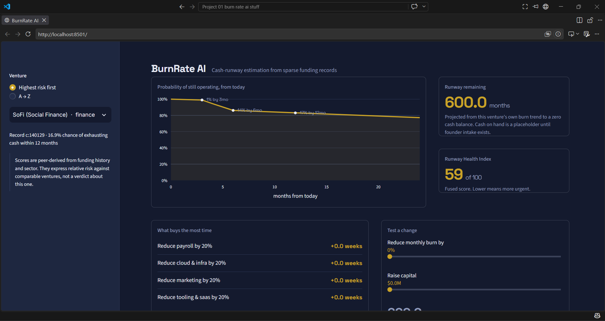
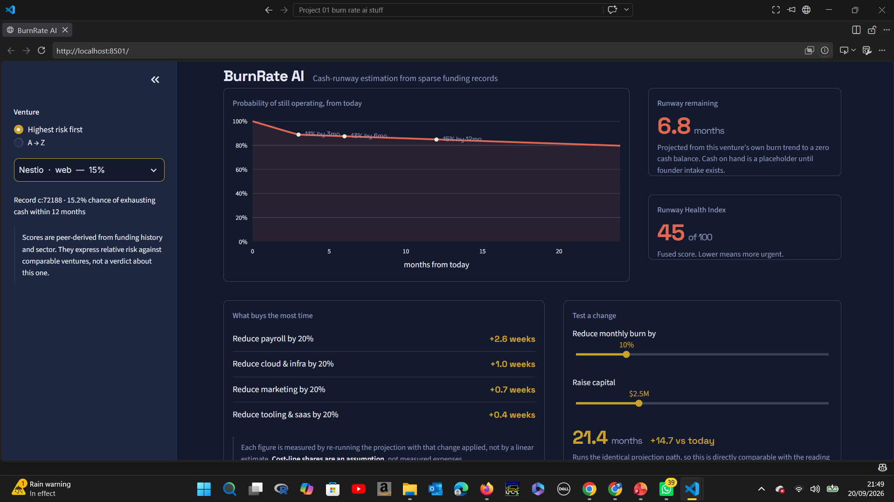
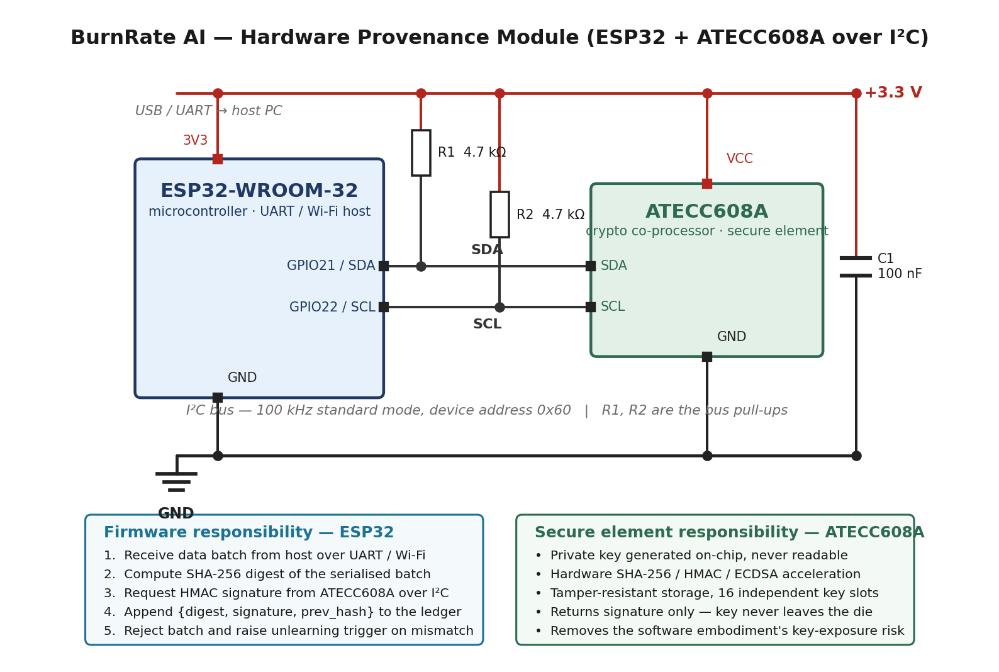

# BurnRate AI

**Estimating startup cash-runway exhaustion from sparse funding records.**

A censoring-aware survival model that predicts how many months an early-stage
venture can continue operating before its cash runs out — using only the thin
public trace a startup actually leaves behind: dated funding rounds, a sector
label, and an eventual outcome.

<p align="center">
  <b>BCSE497J · Project-I</b><br>
  School of Computer Science and Engineering (SCOPE), Vellore Institute of Technology<br>
  Guide: Dr. Rajasekhara Babu M
</p>

| Register No. | Name |
|---|---|
| 23BDS0044 | Arnav Kumar |
| 23BDS0143 | Oleti Sree Vathsa |
| 23BDS0197 | Hari Shree |

---

## Table of contents

- [The problem](#the-problem)
- [What this project does differently](#what-this-project-does-differently)
- [Results](#results)
- [Architecture](#architecture)
- [Dashboard](#dashboard)
- [Hardware provenance module](#hardware-provenance-module)
- [Methodology](#methodology)
- [Experiments](#experiments)
- [Findings reported unadjusted](#findings-reported-unadjusted)
- [Running the project](#running-the-project)
- [Repository layout](#repository-layout)
- [Data and licence](#data-and-licence)
- [Limitations](#limitations)
- [References](#references)

---

## The problem

An early-stage venture that has raised capital and is not yet profitable is
consuming that capital at some rate. The interval before it is exhausted — the
**runway** — decides when the venture must raise again, whether it can afford a
hire, and whether a cost reduction is optional or urgent.

Founders estimate this as `cash ÷ last month's burn`. That calculation assumes
spending is flat, ignores revenue entirely, and carries no confidence interval.
For a company whose headcount and cloud costs are both growing, it is
systematically optimistic at precisely the moment optimism is most expensive.

The instruments built for corporate financial distress cannot be used here:

| Method | Requires | Why it fails for startups |
|---|---|---|
| Beaver (1966), Altman (1968) | Audited balance sheets | Startups publish none |
| Ohlson (1980) | Nine accounting variables | Same dependency, fixed horizon |
| Cox (1972) proportional hazards | A covariate time series | Between funding rounds, none exists |
| Krishna (2016), Żbikowski (2021) | Resolved outcomes | Deletes every still-operating venture |

That last row is the important one. Existing machine-learning work on venture
outcomes frames the task as fixed-horizon binary classification, which forces
every company whose outcome has not yet resolved to be **deleted** from training.
Since most companies in any snapshot are still operating, this discards the
majority of the data — and what remains is not a random sample. It is enriched in
ventures that failed quickly, because those are the ones whose outcome resolved
inside the observation window.

---

## What this project does differently

**It keeps them.** A still-operating venture is admitted as a *right-censored*
observation: we do not know when it will fail, but we know it survived at least
this long, and that is genuine information. This is what survival analysis exists
to handle, and it is the mechanism by which the central claim is established.

Three further contributions follow from taking that approach seriously:

1. **Burn-trajectory synthesis.** Survival analysis needs a covariate history that
   does not exist. Where two funding rounds bracket an interval, a known quantity
   of capital was consumed over a known duration — so implied burn is recoverable
   even though monthly spend was never recorded. We fit conditional spending
   distributions over those recoveries and generate constrained trajectories.

2. **Governance built in, not bolted on.** Every admitted data batch is hashed and
   signed into a tamper-evident ledger at a hardware root of trust. Any record can
   be removed from the fitted model by *exact retraining*, with the removal verified
   programmatically. A failed signature check triggers that removal automatically.

3. **Prescription, not just prediction.** The system does not stop at a probability.
   It perturbs each controllable cost line, **re-executes the projection**, and
   reports the measured displacement of the exhaustion date in weeks.

---

## Results

All figures measured on the Crunchbase 2013 snapshot, 98,280 companies.

### Headline

| Model | Metric | Value |
|---|---|---|
| **Cox proportional hazards (this work)** | Concordance index | **0.769** |
| Fixed-horizon logistic baseline, identical covariates | AUC @ 12 months | 0.667 |
| Companies retained by this work | — | 98,280 |
| Companies **discarded** by the baseline | — | 7,606 (7.7%) |

The estimator is simultaneously **more accurate and more data-efficient** than the
prior-art formulation. That is the project's central claim, and it is established
by measurement rather than argument.

### Generalisation across sectors

Recomputed within each sector stratum, to confirm the result is not an artefact of
fitting one dominant industry.

| Sector | Companies | Concordance |
|---|---|---|
| Consulting | 3,923 | 0.911 |
| Ecommerce | 7,587 | 0.828 |
| Games & video | 5,053 | 0.802 |
| Web | 12,625 | 0.797 |
| Software | 15,238 | 0.796 |
| Other | 43,304 | 0.755 |
| Mobile | 5,433 | 0.709 |

No sector collapses toward the random baseline of 0.5.

### Full experiment table

| # | Experiment | Measured result |
|---|---|---|
| — | Data genuineness | 100% match, 15/15 externally checkable of 20 sampled |
| 1 | Survival vs prior art | 0.769 vs 0.667, retaining 7.7% more data |
| 2 | Value of censoring | 9,428 events (9.6%), 88,852 censored (90.4%) retained |
| 3 | Synthesis fidelity | R² 0.790 held out; MAPE 108.2%, median APE 55.8% |
| 3b | Does synthesis help? | Concordance 0.811 → **0.823** on identical subset |
| 4 | Distress language | AUC 0.726 vs 0.510 for a fixed financial lexicon |
| 5 | Four-signal fusion | 0.581 vs 0.741 survival alone — **does not beat it** |
| 6 | Intervention ranking | Spearman ρ 0.91; median error 0.21 weeks, p90 0.95 |
| 7 | Machine unlearning | Exact; verified for 1-record and 982-record deletion |
| 7b | Hardware provenance | Genuine batch accepted, tampered batch rejected |

---

## Architecture

Five processing tiers, plus a governance rail spanning the data and model tiers.



| Tier | Purpose | Status |
|---|---|---|
| **1 · Data acquisition** | Ingest four streams, schema-validate, fingerprint and sign each batch | Built |
| **2 · Feature construction** | Temporal alignment onto a monthly index; burn-trajectory synthesis; provenance tagging | Built |
| **3 · Model estimation** | Survival estimator, cash-flow projector, distress-language estimator, spend-anomaly detector | Built |
| **4 · Fusion** | Outcome-calibrated Runway Health Index, bounded 0–100 | Built |
| **5 · Application** | Intervention ranking, scenario simulation, dashboard | Built |

The dependency structure is strict in one direction and instructive in the other.
Without Tier 2 synthesis, the survival estimator has no covariate history to
consume. Without Tier 3 censoring, the synthesised trajectories feed a biased
estimator. Without Tier 4 outcome-fitted calibration, the composite score has no
established relationship to real outcomes. Without Tier 5 re-execution, the system
reports a condition without quantifying any remedy.

---

## Dashboard

The Tier 5 application layer, running locally via Streamlit.

### Main view

<!-- Add your screenshot here. Run the app, select a high-risk venture from the
     sidebar, then: python scripts/capture_screenshots.py -->




The hero panel is the venture's own **survival curve** rather than a gauge, with
the 3, 6 and 12-month exhaustion probabilities marked directly on it. These are
*conditional* probabilities — given the venture has already survived to its current
age, what happens over the next year. The unconditional figures measured from
founding span only about 1.3% to 1.7% across the entire population and carry
essentially no discrimination, which is why `src/conditional_survival.py` exists.

### Scenario simulator

<!-- Add your screenshot here — move the burn slider before capturing so the
     panel shows a non-zero delta -->




**Intervention ranking** perturbs each controllable cost line and re-executes the
projection to measure the actual displacement of the exhaustion date. It does not
use a linear approximation — Experiment 6 measures precisely how much such an
approximation would discard.

**Scenario simulation** runs the identical projection path on a modified parameter
vector, so the simulated figure is directly comparable with the live reading rather
than an approximation of it.

### What the dashboard is honest about

A provenance panel on every page states which inputs reach which model:

| Input | Reaches |
|---|---|
| Funding history, rounds, sector | The hazard model |
| Cash, burn, revenue, headcount | **The cash-flow projector only** |

Founder-supplied figures do not feed the survival estimator, because it is fitted
on funding history and sector — none of which a founder can change. Cost-line
shares (payroll 55%, cloud 22%, marketing 15%, tooling 8%) are a **stated
assumption**, not measured expenses, because the snapshot carries no itemised
accounts.

---

## Hardware provenance module

Addresses the gap that every reviewed system assumes its input data is authentic.
The module makes genuineness *attestable* rather than assumed, and supplies an
unambiguous trigger for unlearning when an admitted batch is later found altered.

### Circuit



### Bill of materials

| Ref | Component | Specification | Approx. cost |
|---|---|---|---|
| U1 | ESP32-WROOM-32 | Dual-core 240 MHz, Wi-Fi, UART host | ₹350 |
| U2 | ATECC608A | Crypto co-processor, SOIC-8 | ₹120 |
| R1, R2 | Resistor | 4.7 kΩ, I²C bus pull-ups | ₹2 |
| C1 | Capacitor | 100 nF ceramic, supply decoupling | ₹2 |
| — | Breadboard, jumpers | — | ₹150 |
| | | **Total** | **≈ ₹620** |

### Connections

| ESP32 | ATECC608A | Note |
|---|---|---|
| GPIO21 | SDA | I²C data, pulled up via R1 |
| GPIO22 | SCL | I²C clock, pulled up via R2 |
| 3V3 | VCC | Decoupled by C1 |
| GND | GND | Common reference |

I²C runs at 100 kHz standard mode, device address `0x60`. R1 and R2 are mandatory,
not optional: I²C drivers are open-drain and cannot pull the line high on their own.

### Division of responsibility

The ESP32 receives a data batch, computes its SHA-256 digest, and requests a
signature over that digest from the ATECC608A. **The private key is generated
inside the secure element and is not readable over any interface** — the signature
can be produced, but the key cannot be extracted. The returned signature, the
digest and the previous entry's chain hash are appended to the ledger. Any later
alteration of a stored batch changes its digest, verification fails, and the
unlearning trigger fires.

### Hardware build photographs

<!-- Add photographs of the assembled board here.
     Suggested: (1) full breadboard, (2) close-up of the ATECC608A wiring,
     (3) serial monitor showing a verification PASS and a tampered-batch FAIL -->

| | |
|---|---|
| *Assembled module* | *Close-up: I²C wiring* |
| *(add photo)* | *(add photo)* |
| *Serial output — genuine batch accepted* | *Serial output — tampered batch rejected* |
| *(add photo)* | *(add photo)* |

### Software embodiment

`notebooks/05_hardware_provenance.ipynb` implements the identical hash-chain and
HMAC logic with the key held in ordinary process memory. It is functionally
equivalent for tamper detection and is what the tested results measure. It is
**materially weaker in one respect, stated plainly**: a key resident in
general-purpose memory is extractable by an adversary with host access, whereas a
key inside the secure element is not. Migrating to hardware requires no change to
the chaining logic, only relocation of the signing operation.

---

## Methodology

### Outcome resolution under competing risks

Each company is assigned a duration τ and an event indicator δ. Four cases, in
priority order:

| Case | δ | Time |
|---|---|---|
| Recorded as closed | 1 | Closure date |
| Acquired or IPO'd | 0 | Exit date — an acquired venture can no longer exhaust cash |
| Operating but stale ≥ 36 months | 1 | End of staleness window (presumed dead) |
| Everything else | 0 | Snapshot date (right-censored) |

The staleness threshold is an assumption, so it is reported with a sensitivity scan
at 24 / 36 / 48 months rather than chosen silently.

### Burn-trajectory synthesis

Where two consecutive funding events occur at t<sub>i</sub> and t<sub>i+1</sub>
with the first raising R<sub>i</sub>:

```
implied monthly burn  b̂ᵢ  =  Rᵢ / Δᵢ ,     Δᵢ = (tᵢ₊₁ − tᵢ) in months
```

Intervals under three months are discarded — those are tranches of one round, not
funding cycles. This recovers **24,184 implied-burn observations across 15,563
companies**, median $126,833/month.

A conditional model is then fitted in log space:

```
log(1 + b̂)  =  β₀ + β₁·log(1 + R) + β₂·k + γᵀs + ε ,    ε ~ N(0, σ²)
```

where `k` is the financing-round ordinal and `s` a sector encoding.

> **One design decision is recorded explicitly.** The interval length Δ is
> deliberately **excluded** from the predictors. Since b̂ is *defined* as R/Δ,
> including Δ would let the model reconstruct its own definition and report an
> inflated R² without learning any genuine cross-venture regularity. The round
> ordinal is used instead. This exclusion was introduced after an initial
> specification exhibited exactly that defect.

Generation draws a monthly path and **rescales it so the sum equals R exactly** —
making each trajectory an interpolation pinned wherever reality is known, rather
than an unconstrained simulation. Every generated value is tagged `synthesized`,
and the tag propagates through every downstream stage.

### Censoring-aware survival estimation

```
h(t | x)  =  h₀(t) · exp(βᵀx)
```

The essential property: a right-censored observation contributes to the risk set at
every event time preceding its censoring time. A still-operating venture therefore
supplies real information about which companies survived longest, without requiring
its eventual outcome to be known. That is exactly what fixed-horizon classification
forfeits.

### Conditional survival

The model measures duration **from founding**, so S(6) and S(12) answer "will this
fail within 12 months of being founded" — almost nothing does, and every curve looks
flat. The useful question is conditional:

```
P(fail within d | survived to t)  =  1 − S(t + d) / S(t)
```

computed efficiently via the proportional-hazards identity `S(t|x) = S₀(t)^exp(βᵀx)`,
which needs one baseline curve plus one partial hazard per company rather than an
n × t matrix.

### Exact machine unlearning

Because a partial-likelihood fit over this population completes in seconds,
unlearning is **exact**, not approximate. Exclude the flagged identifiers, refit with
identical hyperparameters and seed, then verify three ways: the absence assertion, a
coefficient comparison, and a concordance comparison. The result reproduces exactly
the model that would have existed had the record never been admitted — a guarantee
the approximate methods developed for deep networks cannot provide.

---

## Experiments

### Experiment 3 — synthesis fidelity

| Quantity | Value |
|---|---|
| Intervals recovered | 24,184 across 15,563 companies |
| R² (training / held out) | 0.784 / **0.790** |
| MAPE | 108.2% |
| **Median APE** | **55.8%** |
| RMSE | $2,463,225 |

> R² 0.790 alongside MAPE 108% is not a contradiction. Burn spans orders of
> magnitude; the model fits in log space with residual σ = 0.93, meaning typical
> predictions land within ~2.5×. For a company burning tens of millions that is a
> modest relative error; for one burning a few hundred dollars the same log-space
> residual yields a percentage error in the hundreds. **Report all three figures.**

### Experiment 5 — full ablation over four signals

5-fold cross-validated AUC, n = 15,507 companies carrying all four signals.

| Signals enabled | n | AUC | σ |
|---|---|---|---|
| **Survival probability only** | 1 | **0.741** | 0.005 |
| Survival + anomaly | 2 | 0.689 | 0.006 |
| Anomaly only | 1 | 0.608 | 0.007 |
| Survival + cash-flow + anomaly | 3 | 0.606 | 0.008 |
| Cash-flow + anomaly | 2 | 0.590 | 0.008 |
| Survival + cash-flow + anomaly + distress-language | 4 | 0.581 | 0.009 |
| Survival + anomaly + distress-language | 3 | 0.581 | 0.009 |
| Cash-flow + anomaly + distress-language | 3 | 0.581 | 0.009 |
| Anomaly + distress-language | 2 | 0.580 | 0.009 |
| Survival + cash-flow + distress-language | 3 | 0.574 | 0.009 |
| Cash-flow + distress-language | 2 | 0.573 | 0.009 |
| Survival + distress-language | 2 | 0.573 | 0.009 |
| Distress-language only | 1 | 0.572 | 0.009 |
| Survival + cash-flow | 2 | 0.549 | 0.007 |
| Cash-flow only | 1 | 0.505 | 0.006 |

### Experiment 6 — what the linearisation discards

Compares full-pipeline re-execution against the flat-burn identity
`runway = cash / burn`.

| Metric | Value |
|---|---|
| Rank correlation (Spearman ρ) | 0.91 |
| **Median absolute error** | **0.21 weeks** |
| 90th percentile absolute error | 0.95 weeks |
| Mean absolute error | 4.61 weeks |

> Mean and median differ by more than an order of magnitude, so the mean alone
> misrepresents the typical case. The distribution is heavy-tailed for a substantive
> reason: where the fitted burn trend is flat or declining, cutting a cost line can
> push the zero-crossing out very far, and the flat-burn identity has no notion of
> trend at all. **The linearisation orders interventions correctly but misstates the
> magnitude** — and magnitude is what a founder acts on.

---

## Findings reported unadjusted

Two results did not go the way we hypothesised. Both are reported as they came out.

### Signal fusion does not beat the survival signal alone

After a three-signal fusion underperformed, we hypothesised the missing
distress-language signal carried the complementary information. We then built that
signal and tested the hypothesis directly. **It is refuted.** Adding the fourth
signal made fusion worse (0.581 vs 0.606 for three signals; both below 0.741 for
survival alone).

Two confounds are stated rather than hidden. The evaluation population is restricted
to companies with a synthesised cash-flow trajectory, and the distress signal is
reduced here to a single scalar — whereas Experiment 4 shows it carries genuine
information (AUC 0.726) over the full 96,360-company population when used directly.

A mechanical observation worth noting: the fitted fusion assigns survival a
**negative** weight (−0.88) while giving anomaly +4.32. Logistic regression on
correlated signals will do this, and it explains *why* fusion underperforms.

### The model cannot recognise famous outcomes

Ranked by 12-month risk, the list includes Facebook, Tesla, Zappos and Groupon. The
Cox model sees funding rounds, total raised and sector only — it has no feature that
distinguishes these outcomes. Heavily-funded companies have more rounds and larger
totals, and the model reads that as signal. **That is a limitation of the covariate
set, not a defect in the fit**; concordance of 0.769 is measured over full durations,
where discrimination is genuine.

---

## Running the project

### Prerequisites

```bash
pip install -r requirements.txt
```

Download the Crunchbase snapshot into `data/raw/` (see [Data and licence](#data-and-licence)).

### Notebooks, in order

```bash
jupyter notebook
```

| # | Notebook | Reads | Writes |
|---|---|---|---|
| 00 | `slim_objects` | `objects.csv` | `objects_slim.csv` |
| 01 | `data_verification` | raw CSVs | `data_manifest.json`, verification sample |
| 02 | `cleaning` | slim + rounds | `outcomes.csv` |
| 03 | `survival_model` | `outcomes.csv` | `survival_scored.csv`, `models/cox_model.pkl` |
| 04 | `unlearning` | 03 | unlearning comparison |
| 05 | `hardware_provenance` | `outcomes.csv` | — |
| 06 | `burn_trajectory_synthesis` | 02 + rounds | `synthetic_trajectories.csv` |
| 07 | `cashflow_projector` | 06 | `cashflow_projections.csv` |
| 08 | `anomaly_detector` | 06 | `spend_anomalies.csv` |
| 09 | `rhi_fusion_partial` | 03, 07, 08 | *(superseded by 12)* |
| 10 | `ablation_and_provenance` | 03, 07, 08 | TABLE 2, TABLE 3 |
| 11 | `distress_language` | `objects.csv` + 02 | `distress_scores.csv` |
| 12 | `rhi_fusion_full` | 03, 07, 08, 11 | `rhi_scores.csv`, ablation |
| 13 | `intervention_ranking` | 06 | `intervention_rankings.csv` |

> **If you re-run notebook 06, you must re-run 07 and 08 before 12.** They read
> `synthetic_trajectories.csv`, and 12 reads *their* output. Skip them and the
> fusion silently evaluates stale data — a mistake that produced a wrong result
> once during development.

### Dashboard

From the project root:

```bash
python src/conditional_survival.py    # adds conditional probabilities — run once
streamlit run app.py
```

Opens at `http://localhost:8501`. The sidebar defaults to **Highest risk first**;
those entries have visibly curved survival plots.

### Utilities

```bash
python scripts/make_demo_data.py          # 400-company slice for sharing (~0.5 MB)
python scripts/capture_screenshots.py     # regenerate docs/ images
```

---

## Repository layout

```
├── app.py                         Streamlit dashboard (Tier 5)
├── requirements.txt
├── .streamlit/config.toml         dashboard theme
├── src/
│   ├── tier5.py                   intervention ranking, scenario simulation
│   ├── conditional_survival.py    conditional exhaustion probabilities
│   └── survival_pipeline.py       standalone pipeline reference
├── notebooks/                     00 – 13, run in order
├── scripts/
│   ├── make_demo_data.py
│   └── capture_screenshots.py
├── docs/                          diagrams and screenshots
├── data/
│   ├── raw/                       source CSVs — not committed
│   └── processed/                 generated artefacts — not committed
├── reports/                       experiment outputs
└── models/                        fitted Cox model
```

---

## Data and licence

Crunchbase 2013 snapshot, distributed via Kaggle as
[`justinas/startup-investments`](https://www.kaggle.com/datasets/justinas/startup-investments),
under the **Community Data License Agreement – Sharing, Version 1.0**.

Raw and processed data are not committed. Download into `data/raw/` and run the
notebooks in order to regenerate every artefact. Every source file is SHA-256
fingerprinted by notebook 01, so the exact inputs behind any result are traceable.

Snapshot date: **2013-12-12**. Record this when citing results — the population and
outcome distribution are fixed as of that date.

---

## Limitations

Stated plainly, because they govern how every number above should be read.

- **Cash on hand is a placeholder.** The snapshot carries no balance-sheet figure,
  so starting cash is a multiple of recent spend until a founder intake form exists.
  Every runway figure inherits this.
- **Cost-line shares are assumed**, not measured. The snapshot has no itemised
  expenses.
- **Interventions move the cash-flow arm only.** The survival estimator is fitted on
  funding history and sector, none of which a founder controls, so perturbing a cost
  line leaves the hazard unchanged. Displacement is displacement of the *projected
  exhaustion date*, not of the hazard.
- **The distress-language estimator reads company descriptions, not dated founder
  text.** Descriptions carry no publication date, so the announcement-exclusion
  window remains unvalidated and the estimator detects company-*type* language
  rather than temporal distress.
- **The fitted coefficients do not transfer.** The methodology generalises to any
  dataset with durations and event indicators, but these coefficients are calibrated
  for US venture data circa 2013 and would need refitting elsewhere.
- **Scores are peer-relative probabilities, not verdicts.** A tool that publicly
  scores companies as likely to fail can become self-fulfilling if investors act on
  it. The output is framed throughout as an early-warning signal conditioned on a
  peer group, the case-reconstruction view is labelled illustrative rather than a
  validated backtest, and any venture can demand removal of its record.

---

## References

Selected from the 66 sources reviewed in the project report.

1. E. I. Altman, "Financial ratios, discriminant analysis and the prediction of corporate bankruptcy," *Journal of Finance*, 23(4), 589–609, 1968.
2. J. A. Ohlson, "Financial ratios and the probabilistic prediction of bankruptcy," *Journal of Accounting Research*, 18(1), 109–131, 1980.
3. D. R. Cox, "Regression models and life-tables," *JRSS: Series B*, 34(2), 187–220, 1972.
4. E. L. Kaplan and P. Meier, "Nonparametric estimation from incomplete observations," *JASA*, 53(282), 457–481, 1958.
5. F. E. Harrell, K. L. Lee and D. B. Mark, "Multivariable prognostic models," *Statistics in Medicine*, 15(4), 361–387, 1996.
6. H. Ishwaran et al., "Random survival forests," *Annals of Applied Statistics*, 2(3), 841–860, 2008.
7. T. Shumway, "Forecasting bankruptcy more accurately: a simple hazard model," *Journal of Business*, 74(1), 101–124, 2001.
8. A. Krishna, A. Agrawal and A. Choudhary, "Predicting the outcome of startups: less failure, more success," *IEEE ICDMW*, 798–805, 2016.
9. K. Żbikowski and P. Antosiuk, "A machine learning, bias-free approach for predicting business success using Crunchbase data," *Information Processing & Management*, 58(4), 2021.
10. T. Loughran and B. McDonald, "When is a liability not a liability?," *Journal of Finance*, 66(1), 35–65, 2011.
11. M. Mintz, S. Bills, R. Snow and D. Jurafsky, "Distant supervision for relation extraction without labeled data," *ACL-IJCNLP*, 1003–1011, 2009.
12. Y. Cao and J. Yang, "Towards making systems forget with machine unlearning," *IEEE S&P*, 463–480, 2015.
13. L. Bourtoule et al., "Machine unlearning," *IEEE S&P*, 141–159, 2021.
14. H. Krawczyk, M. Bellare and R. Canetti, "HMAC: keyed-hashing for message authentication," IETF RFC 2104, 1997.
15. C. Davidson-Pilon, "lifelines: survival analysis in Python," *JOSS*, 4(40), 2019.